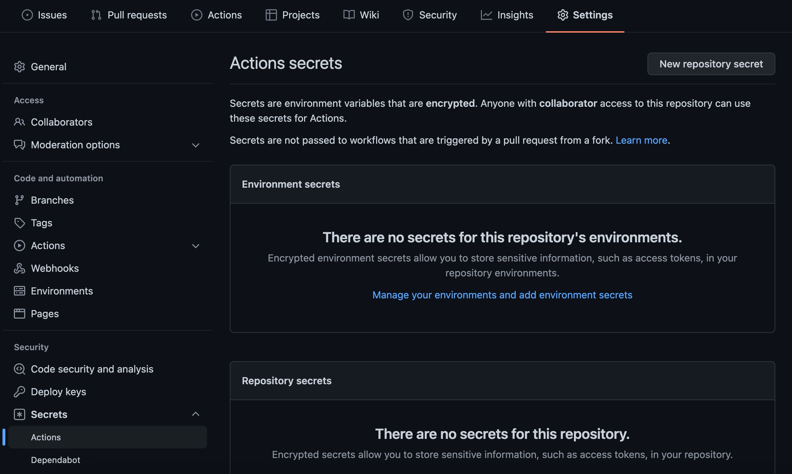

# New Relic as Code Starter

Example project for getting started managing New Relic as code with Terraform
and GitHub Actions.

> **WARNING**: This is an educational tool! Do **NOT** use this for Production
> environments.

## Getting Started

1. Fork this project
2. Create [Terraform Cloud Free account](https://app.terraform.io/signup/account)
3. Complete [Terraform Cloud Setup](https://learn.hashicorp.com/tutorials/terraform/github-actions#set-up-terraform-cloud)
   and configure workspace variables `NEW_RELIC_ACCOUNT_ID`, `NEW_RELIC_API_KEY`, 
   `NEW_RELIC_REGION`. Refer to the [New Relic provider configuration docs](https://registry.terraform.io/providers/newrelic/newrelic/latest/docs/guides/provider_configuration#configuration-via-environment-variables)
   for variable descriptions and where values can be obtained.
4. Configure `TF_API_TOKEN` repository secret
   
5. Configure your New Relic account by editing `main.tf` after line 11.
   Reference [New Relic Terraform Provider Docs](https://registry.terraform.io/providers/newrelic/newrelic/latest/docs)
   for available data types and resources.

Additional Resources:
 * [Terraform Fundamentals](https://learn.hashicorp.com/collections/terraform/cli)
 * [HashiCorp Automate Terraform with GitHub Actions](https://learn.hashicorp.com/tutorials/terraform/github-actions?in=terraform/automation)

